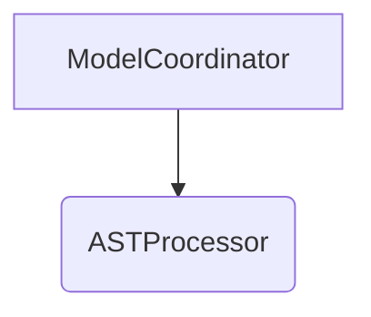

# Dependency Visualization Tools for PowerRebuilder

## Current Dependency Maps

### 1. Generated Import Analysis
- **Location**: `/import_analysis.py` and `/import_analysis_report.md`
- **Created**: During codebase analysis
- **Content**: Text-based import map showing all module dependencies

### 2. Comprehensive Import Map
- **Location**: `/COMPREHENSIVE_IMPORT_MAP.md`
- **Content**: Detailed breakdown of imports by module with issue identification

### 3. New Enhanced Visualizer
- **Location**: `/scripts/dependency_visualizer.py`
- **Features**: Uses Python 3.13 features, generates multiple formats

## Running the Enhanced Visualizer

```bash
# Generate JSON report (default)
python scripts/dependency_visualizer.py

# Generate Mermaid diagram
python scripts/dependency_visualizer.py --format mermaid --output deps.md

# Generate Graphviz DOT file
python scripts/dependency_visualizer.py --format dot --output deps.dot

# Generate all formats
python scripts/dependency_visualizer.py --format all --output full_report.md

# Analyze specific directory
python scripts/dependency_visualizer.py --root src/model --format json
```

## Recommended Third-Party Tools

### 1. **pydeps** - Visual Module Dependencies
```bash
# Install
pip install pydeps

# Generate dependency graph
pydeps src --max-bacon 2 --cluster --noshow -o dependencies.svg
pydeps src/model --only model -o model_deps.svg
```

### 2. **pyreverse** (Part of Pylint)
```bash
# Install
pip install pylint

# Generate UML class diagrams
pyreverse -o png -p PowerRebuilder src/model
pyreverse -o dot -c model.ast.nodes src/model/ast/nodes
```

### 3. **py2puml** - Generate PlantUML Diagrams
```bash
# Install
pip install py2puml

# Generate PlantUML for dataclasses
py2puml src/model/types src/model/ast > models.puml
```

### 4. **pipdeptree** - Package Dependencies
```bash
# Install
pip install pipdeptree

# Show dependency tree
pipdeptree --packages powerrebuilder
pipdeptree --graph-output png > deps.png
```

### 5. **import-linter** - Enforce Import Rules
```bash
# Install
pip install import-linter

# Create .importlinter config
cat > .importlinter << EOF
[importlinter]
root_package = src

[importlinter:contract:1]
name = "Model should not import from Generate"
type = independence
modules =
    src.model
    src.generate

[importlinter:contract:2]
name = "No circular dependencies"
type = layers
layers =
    src.extract
    src.decompile
    src.parse
    src.model
    src.generate
EOF

# Run import linter
lint-imports
```

### 6. **code2flow** - Generate Call Graphs
```bash
# Install
pip install code2flow

# Generate call flow diagram
code2flow src/ -o callgraph.png
code2flow src/model/coordinator.py -o model_flow.png
```

## Python 3.13 Specific Features Used

The enhanced visualizer (`/scripts/dependency_visualizer.py`) uses:

1. **Pattern Matching** (match/case statements)
2. **StrEnum** for better enum handling
3. **@override** decorator for explicit method overriding
4. **Improved dataclass with slots=True**
5. **graphlib** for circular dependency detection
6. **TypedDict** for kwargs typing (PEP 692)
7. **Better error messages with context**

## Visualization Outputs

### JSON Report
Provides:
- Entity counts by type (class, function, dataclass, enum)
- Circular dependency detection
- Broken import identification
- Most dependent modules
- Dataclass usage analysis

### Mermaid Diagram


### DOT/Graphviz
Creates hierarchical module visualization with:
- Subgraphs for each module
- Color coding by entity type
- Dependency arrows

## Integration with Task

Add to `taskfile.yml`:
```yaml
deps:analyze:
  desc: Analyze and visualize dependencies
  cmds:
    - python scripts/dependency_visualizer.py --format json --output deps.json
    - python scripts/dependency_visualizer.py --format mermaid --output deps.md
    - echo "Dependency analysis complete. See deps.json and deps.md"

deps:graph:
  desc: Generate dependency graph
  deps: [deps:analyze]
  cmds:
    - pip install pydeps graphviz
    - pydeps src --max-bacon 2 --cluster -o dependencies.svg
    - echo "Dependency graph saved to dependencies.svg"
```

## Best Practices

1. **Run regularly**: Include dependency analysis in CI/CD
2. **Enforce rules**: Use import-linter to prevent bad patterns
3. **Visualize changes**: Generate before/after diagrams for refactoring
4. **Document layers**: Clearly define module boundaries
5. **Monitor complexity**: Track metrics over time

## Quick Analysis Commands

```bash
# Find circular dependencies
python scripts/dependency_visualizer.py --format json | jq '.circular_dependencies'

# Count dataclasses
python scripts/dependency_visualizer.py --format json | jq '.dataclass_analysis.total'

# List most dependent modules
python scripts/dependency_visualizer.py --format json | jq '.most_dependent[:5]'

# Check specific module
python scripts/dependency_visualizer.py --root src/model --format json | jq '.statistics'
```