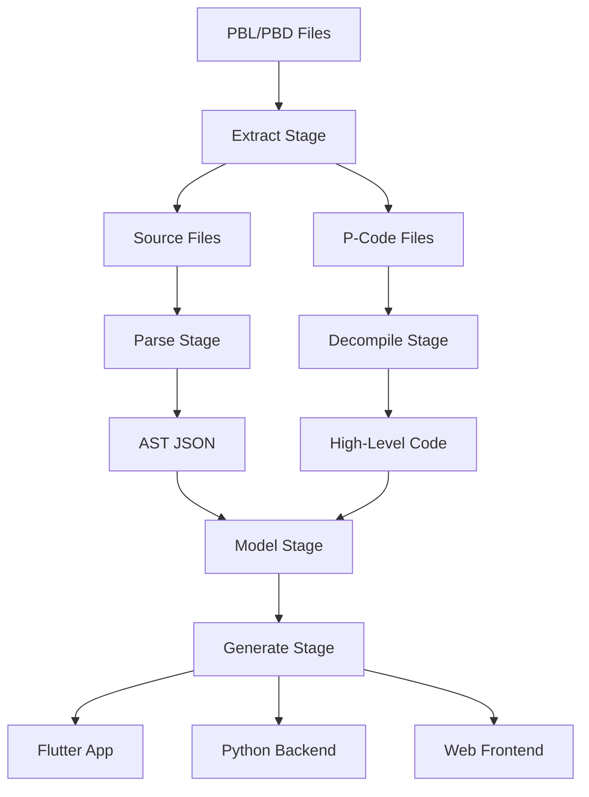

# Data Flow Architecture

## Overview

PowerRebuilder processes PowerBuilder applications through a multi-stage pipeline that transforms legacy code into modern web applications. This document describes how data flows through the system.

## Pipeline Stages



## Stage 1: Extraction

### Input
- PowerBuilder Library files (`.pbl`)
- PowerBuilder Dynamic libraries (`.pbd`)

### Processing
1. **Header Analysis**: Read file headers to determine format and encoding
2. **Node Parsing**: Extract NOD blocks containing entry metadata
3. **Data Extraction**: Follow pointers to DAT blocks with actual content
4. **File Reconstruction**: Rebuild original files from binary data

### Output
Two parallel streams:
- **Source Files**: `.srw`, `.sru`, `.srf`, `.srm`, `.srs`, `.sra`, `.srd`
- **P-Code Files**: `.fun`, `.win`, `.udo`, `.men`, `.mef`, `.apl`, `.apf`

### Data Structures
```python
# Entry metadata from NOD blocks
{
    "name": "w_main",
    "type": "window",
    "size": 45678,
    "offset": 0x1234,
    "timestamp": "2024-01-01T10:00:00",
    "encoding": "unicode"
}
```

## Stage 2: Parsing (Parallel with Decompile)

### Input
- PowerBuilder source files from extraction

### Processing
1. **Preprocessing**: Handle includes, macros, conditional compilation
2. **Tokenization**: Convert source text to tokens
3. **Parsing**: Build parse tree using Lark grammar
4. **AST Construction**: Transform parse tree to Abstract Syntax Tree
5. **Type Resolution**: Resolve type references and imports

### Output
- AST JSON files with structured representation

### Data Structures
```python
# AST node example
{
    "type": "Window",
    "name": "w_main",
    "title": "Main Window",
    "controls": [
        {
            "type": "CommandButton",
            "name": "cb_ok",
            "text": "OK",
            "position": {"x": 100, "y": 200},
            "events": [
                {
                    "name": "clicked",
                    "body": "MessageBox('Info', 'Button clicked')"
                }
            ]
        }
    ]
}
```

## Stage 3: Decompilation (Parallel with Parse)

### Input
- P-Code bytecode files from extraction

### Processing
1. **Opcode Decoding**: Convert bytecode to opcodes
2. **Control Flow Analysis**: Build control flow graph
3. **Data Flow Analysis**: Track variable usage and types
4. **Expression Lifting**: Reconstruct high-level expressions
5. **Code Generation**: Generate readable pseudocode

### Output
- High-level code representation of business logic

### Data Structures
```python
# Decompiled function
{
    "type": "Function",
    "name": "calculate_total",
    "parameters": [
        {"name": "price", "type": "decimal"},
        {"name": "quantity", "type": "integer"}
    ],
    "returns": "decimal",
    "body": [
        "decimal total",
        "total = price * quantity",
        "if total > 1000 then",
        "    total = total * 0.9",
        "end if",
        "return total"
    ]
}
```

## Stage 4: Model Building

### Input
- AST JSON from Parse stage
- Decompiled code from Decompile stage

### Processing
1. **AST Deserialization**: Load and validate AST data
2. **Model Creation**: Build semantic model objects
3. **Cross-Reference**: Link UI elements to business logic
4. **Dependency Resolution**: Build dependency graph
5. **Optimization**: Apply transformations and optimizations

### Output
- Unified model representation combining structure and logic

### Data Structures
```python
# Unified model
{
    "application": {
        "name": "MyApp",
        "windows": [...],
        "datawindows": [...],
        "functions": [...],
        "services": [...]
    },
    "dependencies": {
        "w_main": ["f_calculate", "dw_products"],
        "f_calculate": ["n_business_logic"]
    }
}
```

## Stage 5: Code Generation

### Input
- Unified model from Model stage
- Template configurations

### Processing
1. **Target Selection**: Choose output format (Flutter, Python, etc.)
2. **Template Loading**: Load appropriate Jinja2 templates
3. **Context Building**: Prepare data for templates
4. **Code Generation**: Render templates with model data
5. **Post-Processing**: Format and validate generated code

### Output
- Complete modern application code

### Generated Structure
```
output/
├── flutter/
│   ├── lib/
│   │   ├── screens/
│   │   ├── widgets/
│   │   ├── models/
│   │   └── services/
│   └── pubspec.yaml
├── backend/
│   ├── api/
│   ├── models/
│   ├── services/
│   └── requirements.txt
└── database/
    ├── schema.sql
    └── migrations/
```

## Data Transformation Examples

### Window to Flutter Screen
```powerbuilder
// PowerBuilder
window w_main
    title = "Customer Management"
    commandbutton cb_save
        text = "Save"
        event clicked()
            dw_customer.update()
        end event
    end commandbutton
end window
```

```dart
// Generated Flutter
class CustomerManagementScreen extends StatefulWidget {
  @override
  Widget build(BuildContext context) {
    return Scaffold(
      appBar: AppBar(title: Text('Customer Management')),
      body: Column(
        children: [
          ElevatedButton(
            onPressed: () => _saveCustomer(),
            child: Text('Save'),
          ),
        ],
      ),
    );
  }
  
  void _saveCustomer() {
    customerDataWindow.update();
  }
}
```

### Function to Service Method
```powerbuilder
// PowerBuilder
function decimal calculate_discount(decimal amount, integer customer_type)
    decimal discount = 0
    
    if customer_type = 1 then
        discount = amount * 0.1
    elseif customer_type = 2 then
        discount = amount * 0.15
    end if
    
    return discount
end function
```

```python
# Generated Python
class DiscountService:
    def calculate_discount(self, amount: Decimal, customer_type: int) -> Decimal:
        discount = Decimal('0')
        
        if customer_type == 1:
            discount = amount * Decimal('0.1')
        elif customer_type == 2:
            discount = amount * Decimal('0.15')
            
        return discount
```

## Performance Considerations

### Streaming
- Large files are processed in chunks
- Memory usage stays constant regardless of file size
- Progress tracking for long-running operations

### Sequential Processing
- Each stage must complete before the next begins
- Extract → Decompile → Parse → Model → Generate
- Multiple files can be processed in parallel within each stage

### Caching
- Parsed ASTs cached for reuse
- Template compilation cached
- Validation results cached

## Error Handling

### Recovery Strategies
1. **Syntax Errors**: Error recovery parser continues past errors
2. **Corrupted Data**: Byte-level recovery attempts reconstruction
3. **Missing Dependencies**: Stub generation for missing references
4. **Type Errors**: Best-effort type inference

### Error Propagation
```python
{
    "stage": "parse",
    "file": "w_main.srw",
    "errors": [
        {
            "line": 45,
            "column": 12,
            "message": "Unexpected token 'then'",
            "severity": "error",
            "recovery": "Skipped to next statement"
        }
    ]
}
```

## Monitoring and Metrics

### Stage Metrics
- Files processed per second
- Memory usage per stage
- Error rates and types
- Cache hit rates

### Pipeline Metrics
- Total processing time
- Bottleneck identification
- Resource utilization
- Success/failure rates

---

*Last updated: 2025-07-14*