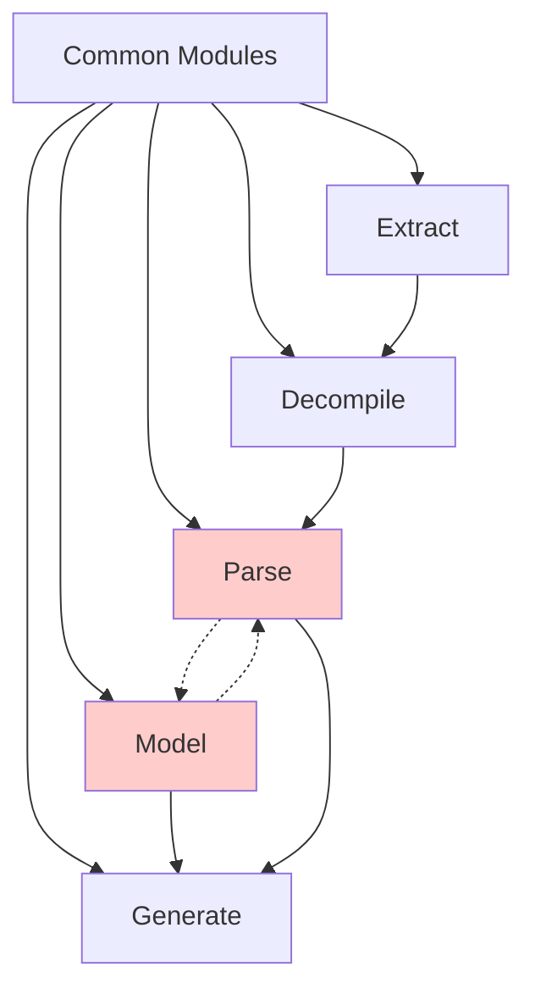

# PowerRebuilder Architecture and Dependency Analysis Report

## Executive Summary

The PowerRebuilder project implements a sequential five-stage pipeline for converting PowerBuilder applications to modern web frameworks. The analysis reveals a well-structured architecture with mostly clean dependencies, though one circular dependency was identified between the Parse and Model stages.

## Pipeline Architecture

### Sequential Processing Flow
```
1. Extract → 2. Decompile → 3. Parse → 4. Model → 5. Generate
    ↓            ↓            ↓         ↓          ↓
  .fun files   .sru files   AST JSON  Models   Modern Code
  (P-code)     (PB source)            (typed)   (Flutter/Python)
```

### Stage Dependencies

#### 1. Extract Stage (`src/extract/coordinator.py`)
- **Purpose**: Extracts P-code files (.fun) from PBL/PBD archives
- **Dependencies**: 
  - Common modules only (security, limits, constants)
  - No dependencies on other pipeline stages ✓
- **Key Components**:
  - PBD reader and scanner
  - Entry parser with recovery mechanisms
  - Resource extraction (images, strings)
  - Security validation

#### 2. Decompile Stage (`src/decompile/coordinator.py`)
- **Purpose**: Converts P-code (.fun) to PowerBuilder source (.sru)
- **Dependencies**:
  - Extract: `src.extract.pbd.*` (structures, utils) ✓
  - Common modules
- **Key Components**:
  - P-code decoder (opcode handling)
  - Control flow analyzer
  - Expression reconstructor
  - Output formatter

#### 3. Parse Stage (`src/parse/coordinator.py`)
- **Purpose**: Converts PowerBuilder source to Abstract Syntax Trees
- **Dependencies**:
  - Model: `src.model.ast.serialization` (for AST serialization) ⚠️
  - Common modules
- **Key Components**:
  - Grammar-based parser (Lark)
  - Error recovery mechanisms
  - Type resolution
  - Import resolution

#### 4. Model Stage (`src/model/coordinator.py`)
- **Purpose**: Builds semantic models from ASTs
- **Dependencies**:
  - Parse: `src.parse.ast_to_model` (for type definitions) ⚠️
  - Common modules
- **Key Components**:
  - Entity creation and management
  - Relationship tracking
  - Validation rules
  - AST deserialization

#### 5. Generate Stage (`src/generate/coordinator.py`)
- **Purpose**: Generates modern code from models
- **Dependencies**:
  - Model: `src.model.utils.errors`
  - Parse: `src.parse.parser.sql`
  - Common modules
- **Key Components**:
  - Template-based generation (Jinja2)
  - Framework-specific converters
  - Type mapping
  - Event wiring

## Circular Dependency Issue

### Identified Circular Import
```
Parse → Model (src.model.ast.serialization)
Model → Parse (src.parse.ast_to_model)
```

This circular dependency exists because:
- Parse needs Model's serialization utilities to save ASTs
- Model needs Parse's type definitions for entity creation

### Recommended Solution
1. Move shared AST types to a common module (`src.common.ast_types`)
2. Move serialization utilities to `src.common.serialization`
3. Both Parse and Model can then import from common without circular deps

## Dataclass Usage Analysis

The project makes extensive use of Python dataclasses (81 files) for type safety and structured data:

### By Module:
1. **Model Module** (28 dataclasses)
   - Entity definitions (Application, Function, Event, etc.)
   - AST node types
   - Type system components
   - Transaction handling

2. **Extract Module** (15 dataclasses)
   - File structures (Header, Entry, Node)
   - Version information
   - Recovery checkpoints

3. **Parse Module** (12 dataclasses)
   - Parser results
   - Type resolution contexts
   - Import dependencies
   - Error recovery blocks

4. **Decompile Module** (10 dataclasses)
   - Decoded objects
   - Control flow blocks
   - Expression nodes
   - Validation results

5. **Generate Module** (14 dataclasses)
   - Converter contexts
   - Template schemas
   - Event mappings
   - Layout strategies

6. **Common Module** (7 dataclasses)
   - Pipeline state
   - Error types
   - Security contexts
   - Resource limits

## Architectural Strengths

1. **Clear Separation of Concerns**: Each stage has a well-defined purpose and minimal coupling
2. **Type Safety**: Extensive use of dataclasses provides compile-time type checking
3. **Error Recovery**: Multiple mechanisms for handling corrupted or invalid data
4. **Extensibility**: Plugin-like architecture for adding new converters/generators
5. **Progress Tracking**: Built-in support for monitoring long-running operations

## Architectural Issues

1. **Circular Dependency**: Parse ↔ Model circular import
2. **Large Coordinator Files**: Some coordinators exceed 1000 lines
3. **Duplicate Type Definitions**: Some types defined in multiple places
4. **Mixed Responsibilities**: Some modules handle both parsing and transformation

## Unused or Redundant Modules

### Potentially Redundant:
1. `src/contracts/` - Appears to be unused interface definitions
2. `src/pipeline/` - Empty directory structure
3. `src/generate/coordinator_refactored.py` - Duplicate of main coordinator
4. `src/common/async_coordinators.py` - Not used in sequential pipeline

### Candidates for Consolidation:
1. Multiple formatter classes in decompile could be unified
2. Several small utility modules could be combined
3. Duplicate validation logic across stages

## Recommendations

### Immediate Actions:
1. **Fix Circular Dependency**: Refactor AST types and serialization to common module
2. **Remove Unused Code**: Delete empty directories and unused modules
3. **Consolidate Utilities**: Merge small utility modules

### Medium-term Improvements:
1. **Split Large Files**: Break down coordinators into smaller, focused components
2. **Standardize Error Handling**: Create common error handling framework
3. **Improve Type Reuse**: Create shared type definitions module

### Long-term Enhancements:
1. **Add Caching Layer**: Cache parsed ASTs and models for performance
2. **Parallelize Where Possible**: Some file processing could be parallel
3. **Create Plugin System**: Make converters true plugins for easier extension

## Dependency Graph



Note: Dotted lines indicate circular dependency

## Module Import Statistics

- Total Python files: 200+
- Files with internal imports: 108
- Files using dataclasses: 81
- Average imports per file: 8-12
- Most imported module: `src.common.types`

## Conclusion

The PowerRebuilder architecture is fundamentally sound with a clear sequential pipeline design. The main issue is the circular dependency between Parse and Model stages, which should be resolved by extracting shared components to a common module. The extensive use of dataclasses provides excellent type safety, and the modular design allows for easy extension and maintenance.