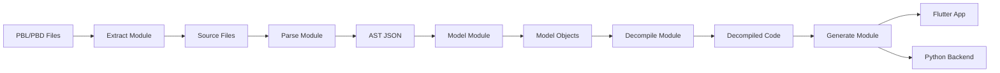
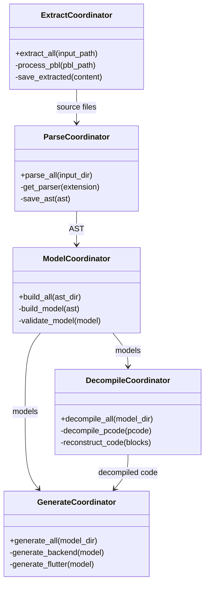
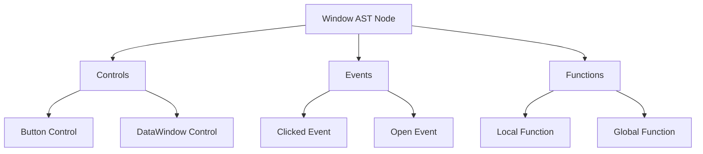

# SIME Finch Architecture

This document consolidates all architectural documentation for the SIME Finch PowerBuilder reverse engineering project.

## Table of Contents

1. [System Overview](#system-overview)
2. [Pipeline Architecture](#pipeline-architecture)
3. [Module Details](#module-details)
4. [Key Design Decisions](#key-design-decisions)
5. [Data Flow](#data-flow)
6. [Technical Implementation](#technical-implementation)
7. [Visual Diagrams](#visual-diagrams)
8. [Known Issues & Future Improvements](#known-issues--future-improvements)

---

## System Overview

SIME Finch is a PowerBuilder reverse engineering toolkit that transforms legacy PowerBuilder applications into modern web applications. The system operates as a five-stage pipeline:

```
PBL/PBD Files → Extract → Parse → Model → Decompile → Generate → Modern Web App
```

### Core Capabilities

- **Extraction**: Decompresses and extracts PowerBuilder library files
- **Parsing**: Converts PowerBuilder syntax to Abstract Syntax Trees (AST)
- **Modeling**: Builds semantic models from AST
- **Decompilation**: Reconstructs high-level code from P-code bytecode
- **Generation**: Produces Flutter/Dart frontend and Python backend code

### Technology Stack

- **Language**: Python 3.11+
- **Parser**: Lark (LALR parser with EBNF grammars)
- **CLI**: Click framework
- **Templates**: Jinja2
- **Configuration**: pyproject.toml
- **Data Classes**: Python dataclasses for AST nodes

---

## Pipeline Architecture

### High-Level Flow



### Module Structure

```
sime-finch/
├── extract/          # Stage 1: File extraction
├── parse/            # Stage 2: Syntax parsing
├── model/            # Stage 3: Semantic modeling
├── decompile/        # Stage 4: P-code decompilation
├── generate/         # Stage 5: Code generation
├── common/           # Shared utilities
└── main.py          # CLI entry point
```

---

## Module Details

### 1. Extract Module

**Purpose**: Extracts source code from PowerBuilder library files (PBL/PBD)

**Key Components**:
- `extract_coordinator.py` - Main coordinator
- `pbd/structures/` - PBD file format structures
- `pbd/extraction/` - Extraction logic
- `pbd/io/` - File I/O operations

**Capabilities**:
- PBL/PBD file parsing
- Header and entry extraction
- Text decompression
- Resource extraction (images, icons)
- Cross-reference analysis

**Output**: Extracted source files (.srw, .srd, .sru, etc.)

### 2. Parse Module

**Purpose**: Parses PowerBuilder syntax into Abstract Syntax Trees

**Key Components**:
- `parse_coordinator.py` - Main coordinator
- `parsers/` - Individual file type parsers
- `grammar/` - Lark grammar files
- `transformers/` - AST transformation logic

**Grammar Files**:
- `powerbuilder.lark` - Core PowerBuilder syntax
- `sql.lark` - Embedded SQL
- `datawindow.lark` - DataWindow syntax

**Capabilities**:
- Window, menu, user object parsing
- DataWindow definition parsing
- SQL statement parsing
- Function and event parsing
- Type system handling

**Output**: AST in JSON format

### 3. Model Module

**Purpose**: Builds semantic models from parsed AST

**Key Components**:
- `model_coordinator.py` - Main coordinator
- `ast/` - AST node definitions
- `entities/` - Domain entities
- `validation/` - Model validation

**PowerBuilder Metamodel**:
```
model/
├── base/          # Base classes (PBEntity, PBType)
├── entities/      # Core entities (functions, events, variables)
├── constructs/    # Language constructs (arrays, SQL)
├── ast/           # AST nodes
├── pb_datawindow/ # DataWindow models
├── pb_transaction/# Transaction models
├── ui/            # UI element models
└── system/        # System definitions
```

**Output**: Validated model objects

### 4. Decompile Module

**Purpose**: Reconstructs high-level code from P-code bytecode

**Key Components**:
- `decompile_coordinator.py` - Main coordinator
- `core/pcode_decoder.py` - P-code instruction decoder
- `core/expression_reconstructor.py` - Expression reconstruction
- `analysis/control_flow_analyzer.py` - Control flow analysis
- `opcodes/opcodes.py` - Opcode definitions

**Capabilities**:
- P-code instruction decoding
- Stack-based expression reconstruction
- Control flow graph generation
- Type inference
- Function decompilation

**Output**: Decompiled PowerBuilder code (.fun files)

### 5. Generate Module

**Purpose**: Generates modern application code from models

**Key Components**:
- `generate_coordinator.py` - Main coordinator
- `backend/` - Python backend generation
- `flutter/` - Flutter frontend generation
- Templates in Jinja2 format

**Generated Code Structure**:
```
output/
├── backend/
│   ├── models/      # SQLModel database models
│   ├── services/    # Business logic services
│   └── api/         # Litestar API endpoints
└── flutter/
    ├── lib/
    │   ├── models/  # Dart model classes
    │   ├── screens/ # Flutter screens
    │   └── widgets/ # Reusable widgets
    └── pubspec.yaml
```

---

## Key Design Decisions

### ADR-01: Pipeline Architecture
**Decision**: Five-stage pipeline with clear separation of concerns
**Rationale**: 
- Each stage has a single responsibility
- Enables parallel development
- Allows intermediate output inspection
- Facilitates testing and debugging

### ADR-02: Lark Parser for PowerBuilder
**Decision**: Use Lark parser with EBNF grammars
**Rationale**:
- Declarative grammar definition
- Good error recovery
- Built-in AST generation
- Active community support

### ADR-03: AST as Dataclasses
**Decision**: Represent AST nodes as Python dataclasses
**Rationale**:
- Type safety with minimal boilerplate
- Automatic __init__ and __repr__
- Easy serialization to JSON
- IDE support for autocompletion

### ADR-04: Jinja2 for Code Generation
**Decision**: Use Jinja2 templates for generating code
**Rationale**:
- Separation of logic and presentation
- Powerful template inheritance
- Easy to maintain and modify
- Familiar to developers

### ADR-05: Graceful Error Handling
**Decision**: Continue processing on errors, collect all issues
**Rationale**:
- Legacy code often has issues
- Partial output better than none
- Comprehensive error reporting
- Easier debugging

---

## Data Flow

### Stage Transitions

1. **PBL/PBD → Source Files**
   ```python
   # Extract binary library to source files
   Library.extract_all() → Dict[str, bytes]
   ```

2. **Source Files → AST**
   ```python
   # Parse source to AST
   Parser.parse(content) → Dict[str, Any]
   ```

3. **AST → Model Objects**
   ```python
   # Build semantic model
   ModelBuilder.build(ast) → PBEntity
   ```

4. **Model + P-code → Decompiled Code**
   ```python
   # Decompile P-code with model context
   Decompiler.decompile(pcode, model) → str
   ```

5. **Model → Generated Code**
   ```python
   # Generate modern code
   Generator.generate(model) → List[GeneratedFile]
   ```

### Data Formats

- **Source**: PowerBuilder text format
- **AST**: JSON with node type and properties
- **Model**: Python objects with validation
- **P-code**: Binary bytecode format
- **Output**: Dart/Python source files

---

## Technical Implementation

### P-code Decompilation

The decompiler uses a multi-pass approach:

1. **Instruction Decoding**: Convert binary to instruction objects
2. **Control Flow Analysis**: Build basic blocks and CFG
3. **Stack Simulation**: Track stack operations
4. **Expression Reconstruction**: Rebuild high-level expressions
5. **Code Generation**: Format as PowerBuilder syntax

### Type System

PowerBuilder types are mapped to modern equivalents:

| PowerBuilder | Python Backend | Flutter/Dart |
|--------------|----------------|--------------|
| integer      | int            | int          |
| long         | int            | int          |
| decimal      | Decimal        | double       |
| string       | str            | String       |
| boolean      | bool           | bool         |
| date         | date           | DateTime     |
| datetime     | datetime       | DateTime     |

### Error Recovery

The parser implements multiple recovery strategies:
- **Synchronization**: Skip to known tokens
- **Panic mode**: Skip problematic sections
- **Error production**: Grammar rules for common errors
- **Fallback parsers**: Legacy parsers for difficult cases

---

## Visual Diagrams

### Component Relationships



### AST Structure Example



---

## Known Issues & Future Improvements

### Current Limitations

1. **Grammar Coverage**: Some PowerBuilder constructs not fully supported
2. **P-code Opcodes**: ~70% opcode coverage
3. **Type Inference**: Limited type inference in decompiler
4. **Performance**: Large PBL files can be slow
5. **Memory Usage**: Entire AST kept in memory

### Planned Improvements

#### High Priority
- Complete opcode implementation
- Streaming parser for large files
- Enhanced error recovery
- Type inference engine
- Symbol table implementation

#### Medium Priority
- Plugin architecture for custom generators
- Incremental parsing
- Parallel processing
- Better DataWindow support
- Cross-reference optimization

#### Low Priority
- GUI for pipeline visualization
- Custom transformation rules
- PowerBuilder version detection
- Migration validation tools

### Performance Optimizations

1. **Lazy Loading**: Load PBD entries on demand
2. **Streaming**: Process files without full memory load
3. **Caching**: Cache parsed grammars and compiled patterns
4. **Parallelization**: Process independent files concurrently
5. **Memory Pool**: Reuse objects to reduce allocation

### Architecture Evolution

Future architectural directions:
- **Microservices**: Split pipeline into separate services
- **Event-driven**: Use message queues between stages
- **Cloud-native**: Containerize for cloud deployment
- **API-first**: REST/GraphQL API for pipeline control
- **Real-time**: WebSocket updates for progress monitoring

---

## Appendix: Module Communication

### Internal APIs

```python
# Extract API
class Library:
    def get_entries() -> List[Entry]
    def extract_entry(entry) -> bytes
    def get_dependencies() -> List[str]

# Parse API  
class Parser:
    def parse(content: str) -> Dict[str, Any]
    def validate(ast: Dict) -> List[Error]
    def get_metadata() -> Dict[str, Any]

# Model API
class ModelBuilder:
    def build(ast: Dict) -> PBEntity
    def validate(model: PBEntity) -> bool
    def get_references() -> List[Reference]

# Decompile API
class Decompiler:
    def decode_pcode(data: bytes) -> List[Instruction]
    def analyze_flow(instructions) -> ControlFlowGraph
    def reconstruct(cfg: ControlFlowGraph) -> str

# Generate API
class Generator:
    def generate_model(entity: PBEntity) -> str
    def generate_service(entity: PBEntity) -> str
    def generate_widget(entity: PBEntity) -> str
```

### Configuration

All modules share configuration through `pyproject.toml`:

```toml
[tool.sime-finch]
# Extract settings
extract.max_file_size = "100MB"
extract.timeout = 300

# Parse settings  
parse.grammar_dir = "parse/grammar"
parse.cache_grammars = true

# Model settings
model.validate = true
model.strict_mode = false

# Decompile settings
decompile.max_iterations = 1000
decompile.optimize = true

# Generate settings
generate.template_dir = "templates"
generate.format_output = true
```