# SIME-Finch Project Architecture (Mermaid Diagrams)

---

## High-Level Pipeline

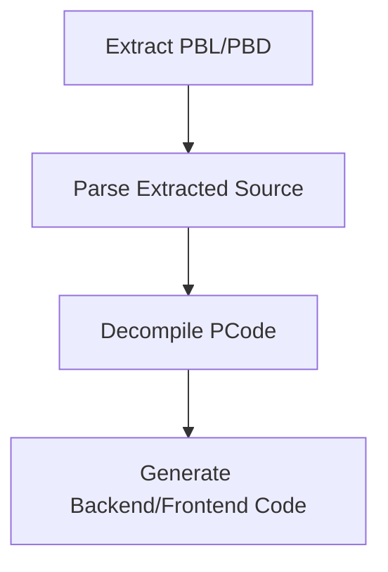

---

## extract/pbd_core

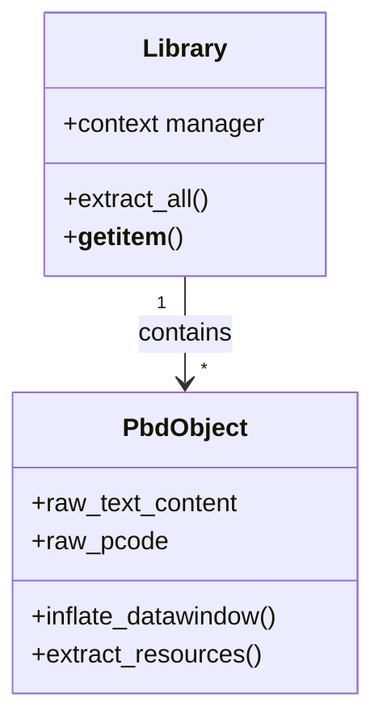

---

## extract/pbd_io

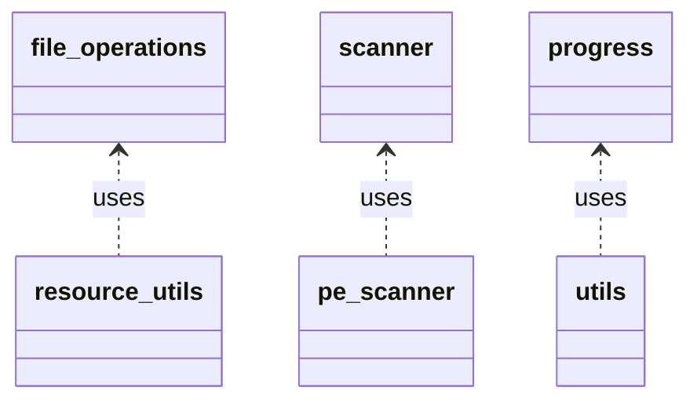

---

## extract/pbd_cli

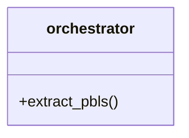

---

## parse/visitors

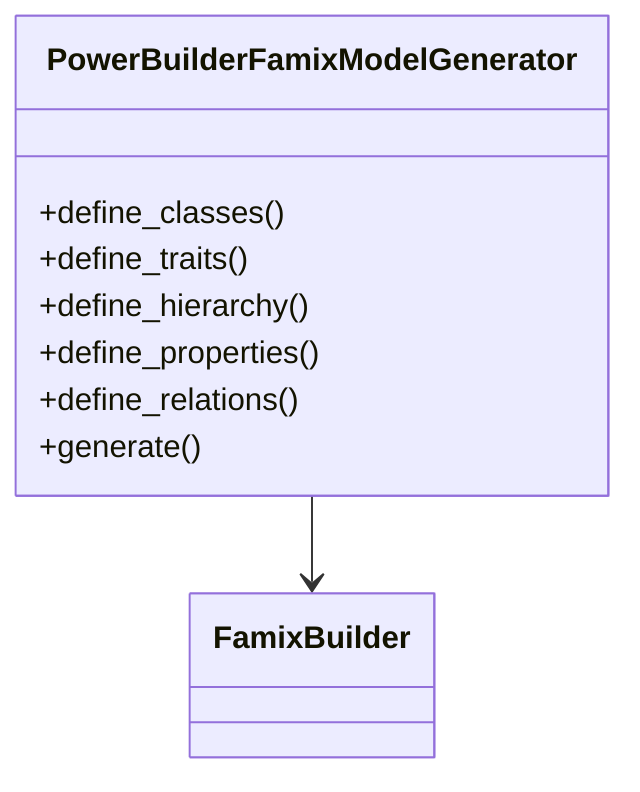

---

## parse/grammar

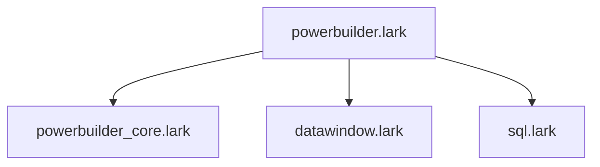

---

## model/ast

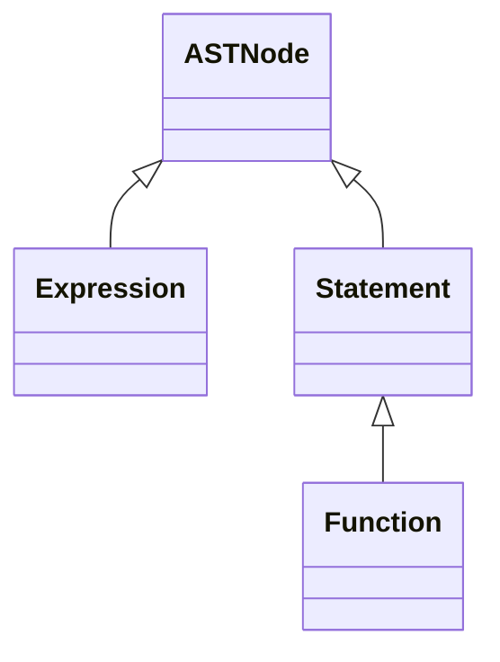

---

## model/attribute

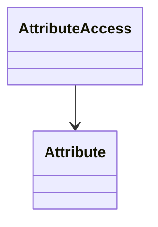

---

## model/datawindow

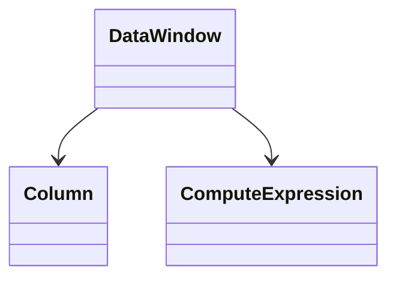

---

## model/transaction

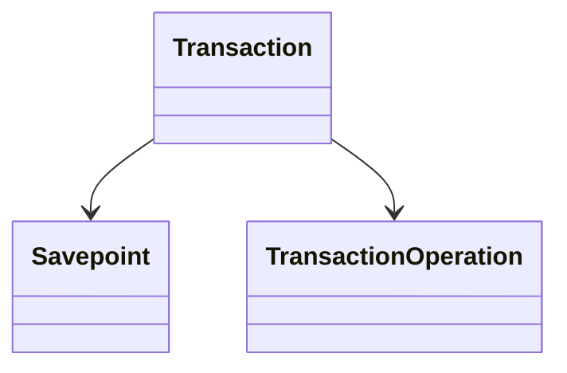

---

## model/library

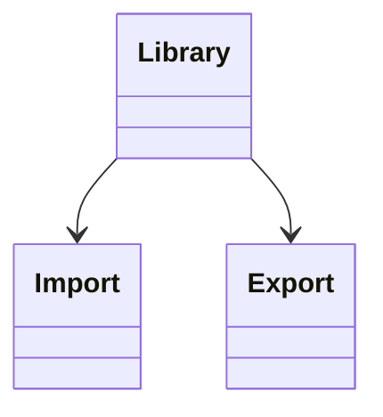

---

## model/ui

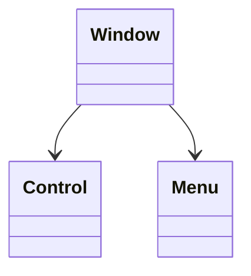

---

## model/source

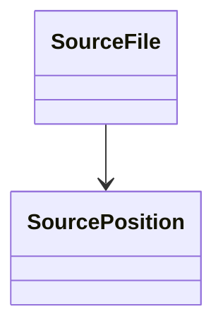

---

## model/utils

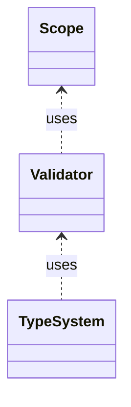

---

## model/analysis

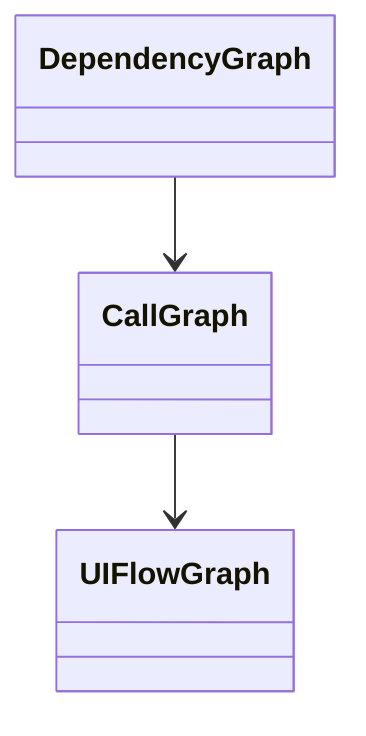

---

## model/pb_datawindow

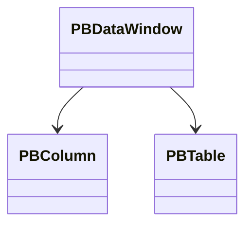

---

## model/pb_transaction

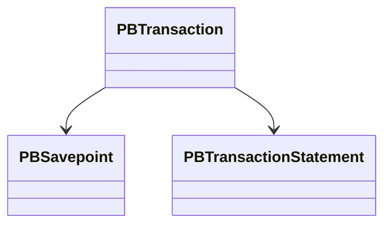

---

## decompile

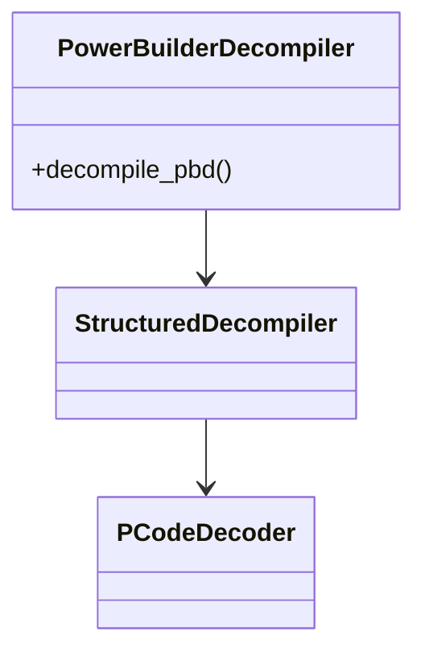

---

## generate

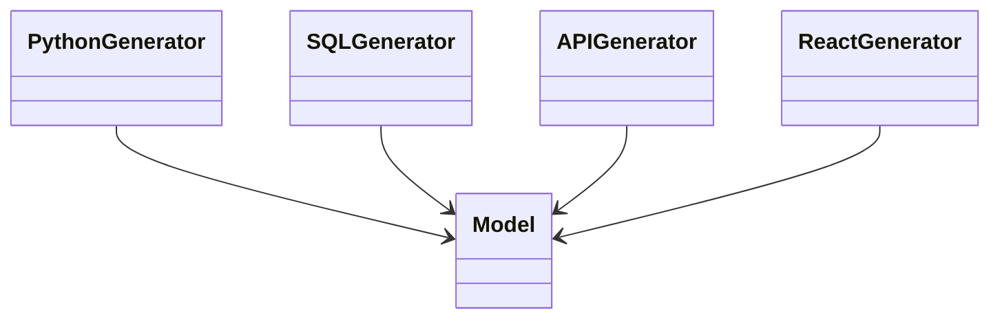

---

# End of Diagrams
