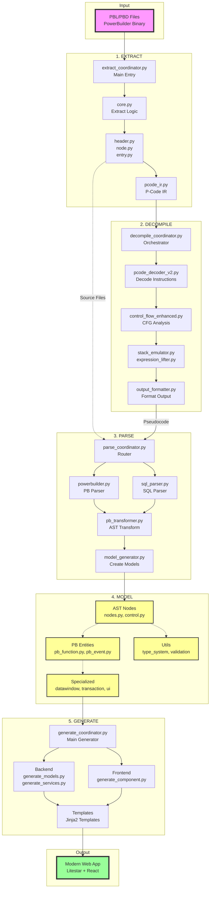

# SIME Finch Pipeline - Simplified Visual Diagram

## High-Level Pipeline Flow



## Key File Relationships

### Extract Module Files
- **Entry**: `pbd_cli/extract_coordinator.py`
- **Core Logic**: `pbd_core/core.py`
- **Outputs**: Raw source files + P-Code binary

### Decompile Module Files
- **Entry**: `decompile_coordinator.py`
- **Pipeline**: 
  - `pcode_decoder_v2.py` → Decode P-Code
  - `control_flow_enhanced.py` → Build CFG
  - `stack_emulator.py` + `expression_lifter.py` → Reconstruct expressions
  - `output_formatter.py` → Format code
- **Outputs**: Structured pseudocode

### Parse Module Files
- **Entry**: `parse_coordinator.py` (routes by file extension)
- **Parsers**:
  - `powerbuilder.py` → Parse PB syntax
  - `sql_parser.py` → Parse SQL
  - `pseudocode_parser.py` → Parse decompiled code
- **Transformers**:
  - `pb_transformer.py` → Convert to AST
  - `model_generator.py` → Create model objects
- **Outputs**: AST nodes and model instances

### Model Module Files
- **AST Layer**: `ast/nodes.py`, `ast/control.py`, `ast/functions.py`
- **PB Layer**: `pb_function.py`, `pb_event.py`, `pb_variable.py`
- **Specialized**: `pb_datawindow/`, `pb_transaction/`, `ui/`
- **Role**: Shared data structures for entire pipeline

### Generate Module Files
- **Entry**: `generate_coordinator.py`
- **Generators**:
  - `backend/generate_models.py` → SQLModel models
  - `backend/generate_services.py` → Litestar services
  - `frontend/generate_component.py` → React components
- **Templates**: Jinja2 templates in `templates/`
- **Outputs**: Modern web application code

## Data Flow Examples

### Example 1: Window Object
```
1. Extract: w_main.srw (raw file) from PBL
2. Parse: parse_coordinator.py → powerbuilder.py → AST
3. Model: Window object with controls, events, functions
4. Generate: React component + API endpoints
```

### Example 2: P-Code Function
```
1. Extract: P-Code binary from PBD
2. Decompile: Bytecode → Instructions → Pseudocode
3. Parse: pseudocode_parser.py → AST
4. Model: Function object with parameters, body
5. Generate: Python function implementation
```

### Example 3: DataWindow
```
1. Extract: d_employee.srd from PBL
2. Parse: parse_coordinator.py → DataWindow syntax parser
3. Model: DataWindow object with SQL, columns, UI
4. Generate: SQLModel model + React data grid
```