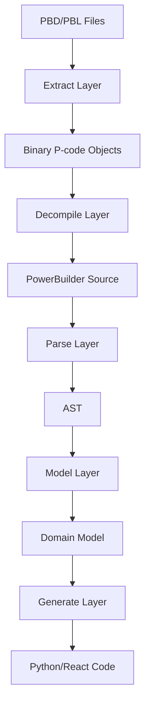

# SIME-Finch Project Structure Map

## Overview

SIME-Finch is a PowerBuilder reverse engineering pipeline that:

1. **Extracts** binary objects from PBD/PBL files
2. **Decompiles** P-code (bytecode) to readable code
3. **Parses** PowerBuilder syntax into AST
4. **Models** the application structure
5. **Generates** modern code (Python/React)

## Directory Structure with File Descriptions

### 📁 `/` (Root)

- **`main.py`** - Main pipeline orchestrator that runs the full extraction → decompilation → parsing → generation pipeline
- **`setup.cfg`** - Python project configuration
- **`pyproject.toml`** - Modern Python project metadata and dependencies
- **`setup_dev.sh`** - Development environment setup script
- **`analyze_pcode_patterns.py`** - Comprehensive P-code pattern analysis tool for opcode research
- **`logs/unknown_opcodes.log`** - Log file tracking unknown opcodes encountered during decoding (generated)

### 📁 `extract/` - Binary Extraction Layer

Handles reading PowerBuilder PBD/PBL binary files and extracting objects.

#### 📁 `extract/pbd_core/` - Core extraction logic

- **`header.py`** - Parses PBD/PBL file headers (HDR blocks), detects Unicode vs ASCII
- **`node.py`** - Extracts NOD (node) blocks that contain directory entries
- **`entry.py`** - Parses ENT* (entry) records that describe objects in the library
- **`dat.py`** - Extracts DAT* (data) blocks containing actual object data
- **`library.py`** - Main Library class that orchestrates extraction of a PBD/PBL file
- **`opcodes.py`** - P-code opcode definitions and helpers (loads from opcodes.yaml, logs unknown opcodes)
- **`opcodes.yaml`** - YAML database of PowerBuilder P-code opcodes
- **`exceptions.py`** - Custom exceptions for extraction errors

#### 📁 `extract/pbd_io/` - I/O utilities

- **`utils.py`** - Binary data parsing utilities (bin2int, decode, etc.)
- **`scanner.py`** - Scans files for PowerBuilder signatures (HDR, NOD, ENT, DAT)

#### 📁 `extract/pbd_cli/` - Command-line interface

- **`extract_pbd.py`** - CLI tool to extract PBD files

### 📁 `decompile/` - P-code Decompilation Layer

Converts binary P-code to readable format.

- **`pcode_decoder.py`** - Decodes binary P-code into text instruction format
  - Uses opcodes module for definitions
  - Logs unknown opcodes for research
  - Produces text format for decompile_structured.py
- **`pcode_to_source.py`** - Converts P-code instructions to PowerBuilder source
- **`decompile_structured.py`** - Structured decompiler that expects text P-code
  - Takes text-based P-code disassembly (address, opcode, operand)
  - Produces structured pseudocode with control flow
  - Uses block analysis and Jinja2 templates

**Note**: Pipeline now works: binary P-code → pcode_decoder.py → text P-code → decompile_structured.py

### 📁 `parse/` - PowerBuilder Syntax Parser

Parses PowerBuilder source code into AST.

#### 📁 `parse/grammar/` - Lark grammar files

- **`powerbuilder_core.lark`** - Core PowerBuilder syntax grammar
- **`powerbuilder_datawindow.lark`** - DataWindow-specific grammar
- **`powerbuilder_expressions.lark`** - Expression parsing grammar

#### Main parsing files

- **`powerbuilder.py`** - Main PowerBuilder parser using Lark
- **`parser.py`** - Parser orchestrator and utilities
- **`pb_preprocessor.py`** - Preprocesses PB code before parsing
- **`ast_transformer.py`** - Transforms Lark parse tree to custom AST

#### 📁 `parse/visitors/` - AST visitors

- **`base_visitor.py`** - Base visitor pattern implementation
- **`syntax_visitor.py`** - Syntax analysis visitor

### 📁 `model/` - Domain Model Layer

Represents PowerBuilder application structure.

#### 📁 `model/core/` - Core abstractions

- **`base.py`** - Base model classes
- **`namespace.py`** - Namespace and scoping
- **`registry.py`** - Object registry
- **`types.py`** - Type system

#### 📁 `model/ast/` - AST node definitions

- **`nodes.py`** - Base AST node classes
- **`expressions.py`** - Expression nodes
- **`statements.py`** - Statement nodes
- **`declarations.py`** - Declaration nodes

#### 📁 `model/ui/` - UI model

- **`window.py`** - Window definitions
- **`controls.py`** - UI control definitions
- **`menu.py`** - Menu definitions

#### 📁 `model/datawindow/` - DataWindow model

- **`datawindow.py`** - DataWindow object model
- **`column.py`** - Column definitions
- **`query.py`** - SQL query model

#### Other model components

- **`pcode.py`** - P-code instruction model
- **`library.py`** - Library/module model
- **`application.py`** - Application-level model

### 📁 `generate/` - Code Generation Layer

Generates modern code from the model.

#### 📁 `generate/backend/` - Backend generation

- **`python_generator.py`** - Generates Python code
- **`sql_generator.py`** - Generates SQL schemas
- **`api_generator.py`** - Generates REST APIs
- **📁 `templates/`** - Jinja2 templates for Python

#### 📁 `generate/frontend/` - Frontend generation

- **`react_generator.py`** - Generates React components
- **`component_generator.py`** - UI component generation
- **📁 `templates/`** - Jinja2 templates for React

### 📁 `tests/` - Test Suite

- **📁 `fixtures/`** - Test data files
  - `simple_window.srw` - Example window source
  - `custom_control.sru` - Example user object
  - Various `.pbd` test files
- **📁 `test_extract/`** - Extraction tests
- **📁 `test_parse/`** - Parser tests
- **📁 `test_model/`** - Model tests
- **📁 `test_generate/`** - Generation tests

### 📁 `docs/` - Documentation

- **`architecture.md`** - System architecture
- **`design-document.md`** - Design decisions
- **`changelog.md`** - Development changelog
- **`parsing_phase_plan.md`** - Parsing implementation plan
- **`project_structure_map.md`** - This file

### 📁 `reference/` - Reference materials

PowerBuilder documentation and examples

### 📁 `input/` - Input files

- **📁 `pbd_files/`** - Source PBD files to process
- **📁 `netpsych/`** - Example PowerBuilder application

### 📁 `output/` - Generated output

Various test runs with extracted files

## Pipeline Flow

## Current Status & Gaps

### ✅ Working

1. **Extraction**: Successfully extracts 2,409 objects from PBD files
2. **Basic Parsing**: Grammar and parser infrastructure exists
3. **Model Structure**: Domain model classes defined
4. **Generation Templates**: Basic templates exist

### 🔧 Gaps to Address

1. **Binary → Text P-code**: Need to convert binary P-code to text format for decompiler ✅ Implemented
2. **P-code Opcodes**: opcodes.yaml needs more opcode definitions (many still unknown)
3. **Full Decompilation**: Need to test the complete pipeline
4. **End-to-end Pipeline**: Components need testing together

### 📊 Test Coverage: 28.35%
