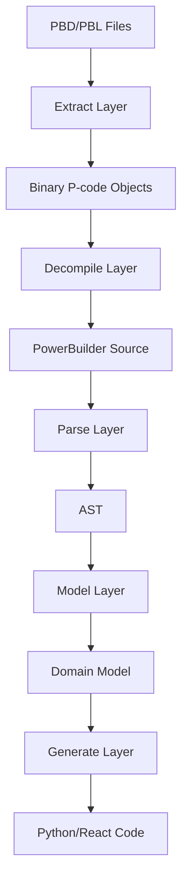

# SIME-Finch Project Structure Guide

## Overview

SIME-Finch is a PowerBuilder reverse engineering pipeline that transforms legacy PowerBuilder applications into modern code. The pipeline follows these stages:

1. **Extract** - Binary extraction from PBD/PBL files
2. **Decompile** - P-code (bytecode) decompilation to readable code
3. **Parse** - PowerBuilder syntax parsing into AST
4. **Model** - Application structure modeling
5. **Generate** - Modern code generation (Python/React)

## Pipeline Flow

## Main Entry Point

- **`main.py`** - Main pipeline orchestrator that runs the full extraction → decompilation → parsing → generation pipeline

## Core Directories

### 1. **extract/** - PBD/PBL File Extraction
Handles reading PowerBuilder PBD/PBL binary files and extracting objects.

#### **extract/pbd_core/** - Core extraction logic
- **`core.py`** - Main extraction engine
- **`header.py`** - Parses PBD/PBL file headers (HDR blocks), detects Unicode vs ASCII
- **`node.py`** - Extracts NOD (node) blocks that contain directory entries
- **`entry.py`** - Parses ENT* (entry) records that describe objects in the library
- **`dat.py`** - Extracts DAT* (data) blocks containing actual object data
- **`library.py`** - Main Library class that orchestrates extraction of a PBD/PBL file
- **`opcodes.py`** - P-code opcode definitions and helpers (loads from opcodes.yaml, logs unknown opcodes)
- **`opcodes.yaml`** - YAML database of PowerBuilder P-code opcodes
- **`datawindow.py`** - DataWindow-specific extraction
- **`pcode_ir.py`** - P-code intermediate representation
- **`exceptions.py`** - Custom exceptions for extraction errors

#### **extract/pbd_io/** - I/O utilities
- **`utils.py`** - Binary data parsing utilities (bin2int, decode, etc.)
- **`scanner.py`** - Scans files for PowerBuilder signatures (HDR, NOD, ENT, DAT)
- **`file_operations.py`** - File handling utilities
- **`pe_scanner.py`** - PE file scanning
- **`resource_utils.py`** - Resource extraction

#### **extract/cli/** - Command-line interface
- **`bin/`** - CLI executables for extraction

### 2. **decompile/** - P-code Decompilation Layer
Converts binary P-code to readable format.

#### Core decompilers
- **`decompile_coordinator.py`** - Main decompiler orchestration
- **`structured_decompiler.py`** - Main structured decompiler
- **`pcode_to_source.py`** - Converts P-code instructions to PowerBuilder source

#### **decompile/core/** - Core components
- **`pcode_decoder.py`** - Decodes binary P-code into text instruction format
  - Uses opcodes module for definitions
  - Logs unknown opcodes for research
  - Produces text format for structured decompiler
- **`control_flow.py`** - Control flow analysis
- **`expression_lifter.py`** - Expression lifting from stack operations
- **`stack_emulator.py`** - Stack-based P-code emulation
- **`output_formatter.py`** - Output formatting

#### **decompile/analysis/** - Analysis tools
- **`control_flow_analyzer.py`** - Advanced control flow analysis
- **`datawindow_extractor.py`** - DataWindow-specific extraction
- **`pcode_detector.py`** - P-code pattern detection

#### **decompile/opcodes/** - Opcode definitions
- **`pb6_0.py`** - PowerBuilder 6.0 opcodes
- **`pb10_5.py`** - PowerBuilder 10.5 opcodes
- **`pb80_0.py`** - PowerBuilder 8.0 opcodes
- **`unified.py`** - Unified opcode table
- **`opcode_manager.py`** - Opcode management
- **`missing_opcodes.yaml`** - Tracking missing opcode definitions

#### **decompile/templates/** - Output templates
- **`structured.py.jinja2`** - Structured code templates
- **`structured_v2.py.jinja2`** - Enhanced v2 templates

### 3. **parse/** - PowerBuilder Syntax Parser
Parses PowerBuilder source code into AST structures.

#### Main parsing files
- **`parse_coordinator.py`** - Parser orchestration
- **`powerbuilder.py`** - Main PowerBuilder parser using Lark
- **`base_parser.py`** - Base parser implementation
- **`pb_preprocessor.py`** - Preprocesses PB code before parsing
- **`sql_parser.py`** - SQL parsing
- **`pseudocode_parser.py`** - Pseudocode parsing
- **`parse_schema.py`** - Schema parsing
- **`parse_ui.py`** - UI-specific parsing

#### **parse/grammar/** - Lark grammar files
- **`powerbuilder.lark`** - Main PowerBuilder grammar
- **`powerbuilder_core.lark`** - Core PowerBuilder syntax grammar
- **`common_grammar.lark`** - Shared grammar rules
- **`sql.lark`** - SQL grammar
- **`datawindow.lark`** - DataWindow-specific grammar
- **`window_grammar.lark`** - Window-specific grammar

#### **parse/visitors/** - AST visitors and transformers
- **`abstract_visitor.py`** - Base visitor pattern implementation
- **`pb_transformer.py`** - PowerBuilder AST transformer
- **`sql_transformer.py`** - SQL transformer
- **`model_generator.py`** - Model generation from AST
- **`entity_creator.py`** - Entity creation
- **`position_tracker.py`** - Source position tracking

### 4. **model/** - Domain Model Layer
Represents PowerBuilder application structure.

#### **model/ast/** - Abstract Syntax Tree nodes
- **`nodes.py`** - Base AST node classes
- **`control.py`** - Control flow nodes
- **`functions.py`** - Function-related nodes
- **`types.py`** - Type definitions
- **`arrays.py`** - Array handling
- **`io.py`** - I/O related nodes

#### **model/entities/** - Core PowerBuilder entities
- **`pb_application.py`** - Application model
- **`pb_function.py`** - Function model
- **`pb_variable.py`** - Variable model
- **`pb_event.py`** - Event model
- **`pb_expression.py`** - Expression model
- **`pb_argument.py`** - Function argument model

#### **model/base/** - Base classes
- **`pb_entity.py`** - Base entity class
- **`pb_behavioral.py`** - Behavioral base classes
- **`pb_file.py`** - File representation
- **`pb_type.py`** - Type system base

#### **model/datawindow/** - DataWindow models
- **`datawindow.py`** - DataWindow object model
- **`datawindow_stubs.py`** - DataWindow stubs

#### **model/pb_datawindow/** - Enhanced DataWindow models
- **`datawindow.py`** - DataWindow representation
- **`column.py`** - Column definitions
- **`table.py`** - Table structures

#### **model/ui/** - UI models
- **`ui_elements.py`** - UI control definitions

#### **model/system/** - System definitions
- **`functions.py`** - System function definitions
- **`events.py`** - System event definitions
- **`globals.py`** - Global system definitions

#### **model/utils/** - Utility functions
- **`type_system.py`** - Type system implementation
- **`validation.py`** - Model validation
- **`scope.py`** - Scoping utilities

### 5. **generate/** - Code Generation Layer
Generates modern code from the model.

- **`generate_coordinator.py`** - Generation orchestration
- **`jinja_filters.py`** - Custom Jinja2 filters

#### **generate/backend/** - Backend generation
- **`generate_models.py`** - Generates Python model classes
- **`generate_services.py`** - Generates service layer code
- **`templates/`** - Jinja2 templates for Python
  - **`sqlmodel_model.jinja2`** - SQLModel templates
  - **`service.py.jinja2`** - Service layer templates
  - **`system_functions.py.jinja2`** - System function templates

#### **generate/frontend/** - Frontend generation
- **`generate_component.py`** - Generates React components
- **`templates/`** - Jinja2 templates for React
  - **`component.tsx.jinja2`** - React component templates
  - **`component.astro.jinja2`** - Astro component templates
  - **`listview.tsx.jinja2`** - ListView templates
  - **`richtext.tsx.jinja2`** - RichText templates

### 6. **tests/** - Test Suite
Comprehensive test coverage for all components.

- **`conftest.py`** - Pytest configuration
- **`test_extract/`** - Extraction layer tests
- **`test_parse/`** - Parser tests
- **`test_decompile/`** - Decompiler tests
- **`test_model/`** - Model tests
- **`test_generate/`** - Generation tests

#### **tests/fixtures/** - Test data
- **`pbd_files/`** - Sample PBD files for testing
- **`pcode_files/`** - P-code test files
- **`simple_window.srw`** - Example window source
- **`custom_control.sru`** - Example user object

### 7. **scripts/** - Development and Analysis Scripts

#### **scripts/opcodes/** - Opcode-related scripts
- **`discovery/`** - Opcode discovery tools
  - **`opcode_discovery_pipeline.py`** - Automated opcode discovery
  - **`add_missing_opcodes.py`** - Add discovered opcodes
- **`extraction/`** - Opcode extraction
  - **`extract_all_opcodes.py`** - Extract opcodes from reference implementations
  - **`list_all_objects.py`** - List objects in PBD files
- **`validation/`** - Validation tools
  - **`compare_decompilers.py`** - Compare decompiler outputs
  - **`validate_opcode_logic.py`** - Validate opcode logic

#### **scripts/pipeline/** - Pipeline testing
- **`test_full_pipeline.py`** - End-to-end pipeline testing
- **`test_enhanced_decompiler.py`** - Enhanced decompiler testing

#### **scripts/debug/** - Debug utilities
- **`debug_entry_33.py`** - Debug specific entry issues
- **`debug_pcode_extraction.py`** - P-code extraction debugging

### 8. **docs/** - Documentation
Project documentation and analysis.

- **`architecture.md`** - System architecture
- **`implementation_roadmap.md`** - Implementation plan
- **`decompilation_progress.md`** - Decompilation status
- **`opcode_reference.md`** - Opcode documentation
- **`changelog.md`** - Development changelog
- **`session_notes_*.md`** - Development session notes

### 9. **reference/** - Reference Materials
External references and implementations.

- **`pbdviewer/`** - C# reference implementation
- **`powerbuilder-decompile/`** - Python reference implementation
- **`pb_code_examples/`** - PowerBuilder code samples by version
- **`opcode_reference.yaml`** - Comprehensive opcode reference

### 10. **input/** and **output/**
- **`input/`** - Source files to process
- **`output/`** - Generated output files

## Configuration Files

- **`pyproject.toml`** - Python project metadata and dependencies
- **`setup.cfg`** - Python project configuration
- **`Makefile`** - Build automation

## Current Status

### ✅ Working Components
1. **Extraction**: Successfully extracts objects from PBD files
2. **P-code Decoding**: Binary to text P-code conversion implemented
3. **Basic Parsing**: Grammar and parser infrastructure exists
4. **Model Structure**: Domain model classes defined
5. **Generation Templates**: Basic templates for Python/React

### 🔧 Areas for Enhancement
1. **Opcode Coverage**: Many P-code opcodes still need definition
2. **Full Decompilation**: Complex control flow reconstruction
3. **End-to-end Testing**: Full pipeline integration testing
4. **Code Generation**: Complete implementation of generators

### 📊 Test Coverage: 28.35%

## Development Workflow

1. **Extract**: Use `extract/` to read PBD/PBL files and extract components
2. **Decompile**: Use `decompile/` to convert P-code back to source
3. **Parse**: Use `parse/` to parse PowerBuilder source code into AST
4. **Model**: Transform AST into semantic model using `model/`
5. **Generate**: Use `generate/` to produce target code from model

Each phase has its own directory with focused responsibilities, making the codebase modular and maintainable. The pipeline is designed to be extensible, allowing for incremental improvements and support for additional PowerBuilder versions.